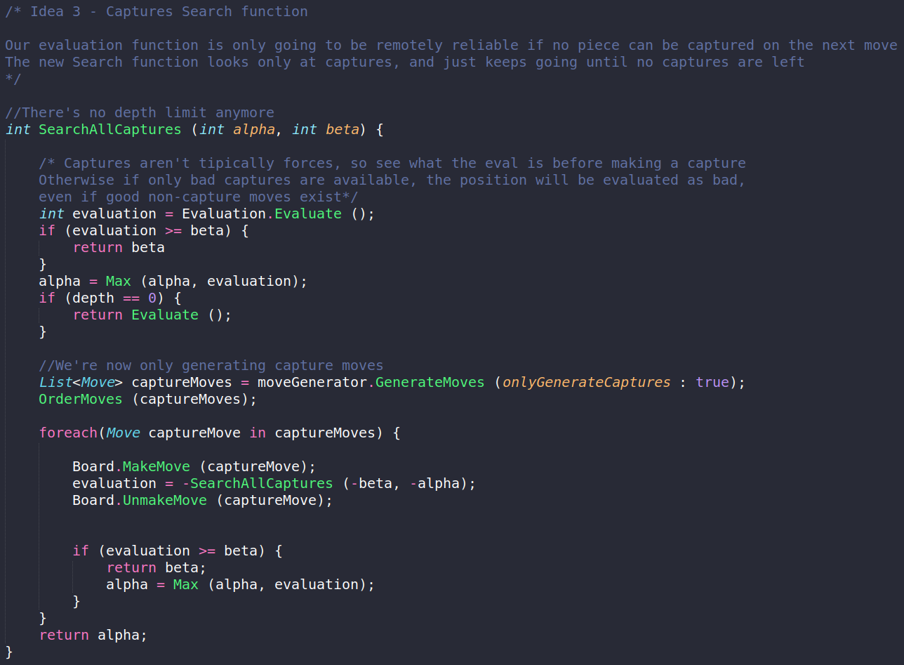

# Chess-Project
Basic Chess project in C#

The project works as a blueprint and applies the fundamental logic to create a Chess AI game with an explained code and its main ideas :scroll::horse:

	

